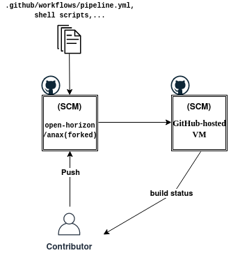
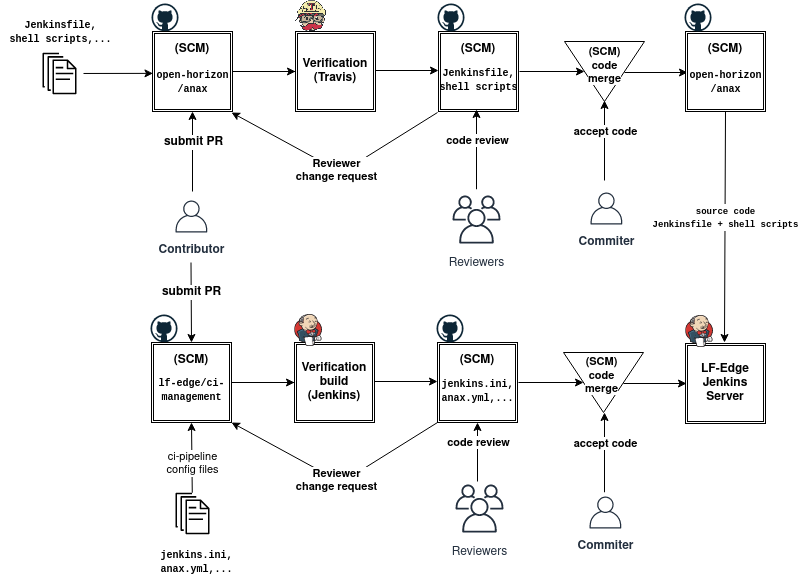

# Continuous Integration Systems for Open Horizon Projects
It is required to migrate from Travis CI technology to a more open-source friendly plateform. We outline here the main criteria to choose the next technology for Open Horizon projects. We evaluate the following two options: GitHub actions and LF-Edge Jenkins based infrastructure. As an open-source project, the most important metric is the cost and usage limit. We also consider performance as a key indicator metric. We gauge the considered CI technologies in action by evaluating their job execution time. 
## GitHub Actions
Let us first start with GitHub actions:
### Usage limits and costs
GitHub actions are freely available for open-source projects. However, there are some usage limits apply to all membership plans that we have to take into consideration:

1. Job execution time - Each job in a workflow can run for up to 6 hours of execution time. If a job reaches this limit, the job is terminated and fails to complete.
2. Workflow run time - Each workflow run is limited to 72 hours. If a workflow run reaches this limit, the workflow run is cancelled.
3. API requests - You can execute up to 1000 API requests in an hour across all actions within a repository. If exceeded, additional API calls will fail, which might cause jobs to fail.
4. Concurrent jobs - The maximum number of concurrent jobs you can run in your account is 20 (5 for macOS). If exceeded, any additional jobs are queued.
5. Job matrix - A job matrix can generate a maximum of 256 jobs per workflow run. This limit also applies to self-hosted runners.
### GitHub hosted runners
Hardware specification for Windows and Linux virtual machines:
* 2-core CPU
* 7 GB of RAM memory
* 14 GB of SSD disk space

Hardware specification for macOS virtual machines:
* 3-core CPU
* 14 GB of RAM memory
* 14 GB of SSD disk space
## LF-Edge Infrastructure
It utilizes Jenkins Job Builder (JJB), which is a Jenkins plugin that facilitates the automation of project configuration (configuration as a code). Otherwise, we hve to use the Jenkins UI to do the configurations manually, which is error-prone.
### Usage limits and costs
There is no cost of using LF-Edge infrastructure for Open Horizon projects. However, the usage limits are not defined in their documentation. At the time of this reporting, they offer Centos and Ubuntu virtual machines with single vCPU, 2 GB of memory, and 8 GB of disk space.

Therefore, in terms of VM specifications, GitHub-hosted runners are more powerful than LF-Edge. However, as Open Horizon falls under the same umbrella as LF-Edge, the type of VMs and their specifications are expected to be negotiable if there is a need for the upgrade.
## Performance evaluation
The next step is to evaluate the CI technologies in action by implementing a proof of concept ci pipeline. We have chosen to implement e2e-dev-test suite to evaluate the performance of the pipelines. The diagram below shows the process of ci pipeline development using GitHub actions. No special permissions are needed and everything is under the control of the pipeline developer. 

For the LF-Edge infrastructure, our experience in ci pipeline development is summarized in the diagram below. Compared to GitHub actions, the files related to the ci pipeline under development are hosted in two different repos. The first repo is the `lf-edge/ci-management` that hosts the pipeline configuration files (the yaml files). To implement e2e-dev-test for the `anax` project, the job configuration file(s) `anax.yml` should be included in a separate directory in `jjb/`, i.e., `jjb/anax/` in the `lf-edge/ci-management` repo. This yaml file defines the type of the job (in our case pipeline), the `url` of the `anax` project repo where the `Jenkinsfile` is stored, and the type of the event that triggers the job (pull request submission in our case). To build the job using LF-Edge Jenkins, a PR is submitted to `lf-edge/ci-management` repository. When the PR is accepted, the job is scheduled for the build using one of the available executors. Because Jenkins job builder is not widely adopted, nor its documentation is friendly especially for beginners, the only way to figure out the right settings is to experiment with different configurations. However, since each experiment with a new configuration requires a PR submission to `lf-edge/ci-management`, the incurred delay hurts the whole development experience.

In the second repo, where the `anax` source code is hosted, we have to include the `Jenkinsfile`, in which the e2e-dev-test is implemented. Since LF-Edge Jenkins server does not build jobs for projects in personal GitHub accounts. We have to submit a PR to the `anax` repo to test every change made to `Jenkinsfile`. As per LF-Edge requirements, the GitHub account that hosts the source code to be built should belong to, or be affiliated with, LF-Edge. Because merging a PR is a manual process, again, unavoidable delays have been introduced. To mitigate this issue, access to a Jenkins sandbox is given. However, because the sandbox environment and agent types do not match what available in the production Jenkins server, using sandbox does not fully solve the issue. In fact, the Jenkins sandbox does not offer any advantages over a locally installed Jenkins server. The good news is that as soon as the configuration of the pipeline is done, we don't need to go through this process anymore. Most of the time, we will be in the upper part of the diagram, where the source code of the project is hosted.

We benchmarked the GitHub implemented pipeline and the table below lists the obtained statistics. The numbers shown are the average of 5 runs.

Job type | Time cost (min)
-------- | ---------------
`make test` | 44
`make test TEST_VARS="NOLOOP=1"` | 18
`make test TEST_VARS="NOLOOP=1 TEST_PATTERNS=sloc"` | 16
`make test TEST_VARS="NOLOOP=1 TEST_PATTERNS=sall"` | 40

For LF-Edge Jenkins, the statistics are shown below:

Job type | Time cost (min)
-------- | ---------------
`make test TEST_VARS="NOLOOP=1"` | 30
`make test TEST_VARS="NOLOOP=1 TEST_PATTERNS=sloc"` | 29
`make test TEST_VARS="NOLOOP=1 TEST_PATTERNS=sall"` | 52

As expected, the performance is better for GitHub actions. Another point worth mentioning for LF-Edge Jenkins, running multiple jobs in parallel using a job matrix with different test parameters always fails; because Jenkins usually allocates an executor for each job on the same VM, which does not work for e2e-dev-test like jobs. As a workaround, each job should either run in a separate VM, or all jobs run sequentially.
