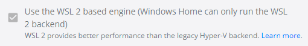

Note: need someone with actual proofreading ability to edit this

# Installation Instructions

## WSL 1
WSL currently isn't supported by Docker Desktop

## WSL 2 Setup
First, ensure you have a WSL 2 distro installed. If not, refer to https://docs.microsoft.com/en-us/windows/wsl/install

Install and run Docker Desktop https://docs.docker.com/desktop/windows/install/

Ensure the following is checked



Run the following in order to have systemd run as PID = 1
```bash
sudo apt update

cd /tmp
wget --content-disposition \
  "https://gist.githubusercontent.com/djfdyuruiry/6720faa3f9fc59bfdf6284ee1f41f950/raw/952347f805045ba0e6ef7868b18f4a9a8dd2e47a/install-sg.sh"

chmod +x /tmp/install-sg.sh

/tmp/install-sg.sh && rm /tmp/install-sg.sh
```

exit the WSL terminal and shutdown the WSL env, run in cmd:

```wsl --shutdown```

To open a new WSL terminal with systemd enabled, open WSL and run:

```genie -l```

Prove that it works:

```sudo systemctl status time-sync.target```

### debugging
Run 
```systemctl list-units --failed```
, then refer to https://github.com/arkane-systems/genie/wiki/Systemd-units-known-to-be-problematic-under-WSL

## Install mgmt hub
Clear all docker containers using Docker Desktop


Run in wsl
```sudo -i```

 then 
 
```bash
curl -sSL https://raw.githubusercontent.com/open-horizon/devops/master/mgmt-hub/deploy-mgmt-hub.sh -o deploy-mgmt-hub.sh
```
Open the script in test editor of choice, set ```EXCHANGE_WAIT_ITERATIONS``` to ```120```

Run the following in sudo mode
```bash
./deploy-mgmt-hub.sh -PS
./deploy-mgmt-hub.sh -A -E
```


Since WSL 2 doesn't play nicely with everything, save the following keys to a file, otherwise, you may need to rerun this section

```bash
export HZN_EXCHANGE_URL=http://127.0.0.1:3090/v1
export HZN_FSS_CSSURL=http://127.0.0.1:3090/edge-css
export HZN_ORG_ID=myorg
export HZN_DEVICE_TOKEN=<get from output>
export EXCHANGE_ROOT_PW==<get from output>
export EXCHANGE_HUB_ADMIN_PW=<get from output>
export EXCHANGE_SYSTEM_ADMIN_PW=<get from output>
export EXCHANGE_USER_ADMIN_PW=<get from output>
export HZN_EXCHANGE_USER_AUTH=admin:<EXCHANGE_USER_ADMIN_PW>
export AGBOT_TOKEN=<get from output>
export VAULT_UNSEAL_KEY=<get from output>
export VAULT_ROOT_TOKEN=<get from output>
export HZN_FSS_CSSURL=http://127.0.0.1:3090/edge-css # only if installing from the "all in one"
```

## Installing the agent
Export the above keys

Run the following

```bash
wget https://github.com/open-horizon/anax/releases/latest/download/horizon-agent-linux-deb-amd64.tar.gz 
tar -xvf horizon-agent-linux-deb-amd64.tar.gz
curl -sSL https://github.com/open-horizon/anax/releases/latest/download/agent-install.sh -o agent-install.sh
export HORIZON_URL=http://localhost:8081
./agent-install.sh
```

Run the following to change how agent is started

```bash
cd /usr/horizon/bin
sudo mv  horizon-container horizon-container.orig
curl -sSL https://raw.githubusercontent.com/olympien13/IEAM/main/IEAM4.1-WSL-Agent/horizon-container -o horizon-container
sudo chmod 755 horizon-container
```

run ```docker pull tncibmniceteam/amd64_win_anax:2.26.12``` to fetch the recompiled script (coutresy of olympien13)

Test by running ```sudo horizon-container start``` then ```docker ps``` and ```hzn node list```

You should see something like this:

```bash 
{
  "id": "node1",
  "organization": null,
  "pattern": null,
  "name": null,
  "nodeType": null,
  "token_last_valid_time": "",
  "token_valid": null,
  "ha": null,
  "configstate": {
    "state": "unconfigured",
    "last_update_time": ""
  },
  "configuration": {
    "exchange_api": "http://127.0.0.1:3090/v1/",
    "required_minimum_exchange_version": "2.23.0",
    "preferred_exchange_version": "2.23.0",
    "mms_api": "http://127.0.0.1:3090/edge-css",
    "architecture": "amd64",
    "horizon_version": "local build"
  }
}
```

## Running a service
run 
```
hzn
```


Refer to .md (work in progress)

## Notes
If you are getting errors, ensure you are in the genie by running ```genie -b```

Do not, under any circumstance, close the shell instance. It bricked a open horizon environment, and I eventually gave up and reinstalled everything on a fresh wsl instance

srcs:

https://nickjanetakis.com/blog/a-linux-dev-environment-on-windows-with-wsl-2-docker-desktop-and-more
https://gist.github.com/djfdyuruiry/6720faa3f9fc59bfdf6284ee1f41f950
https://github.com/olympien13/IEAM/tree/main/IEAM4.1-WSL-Agent